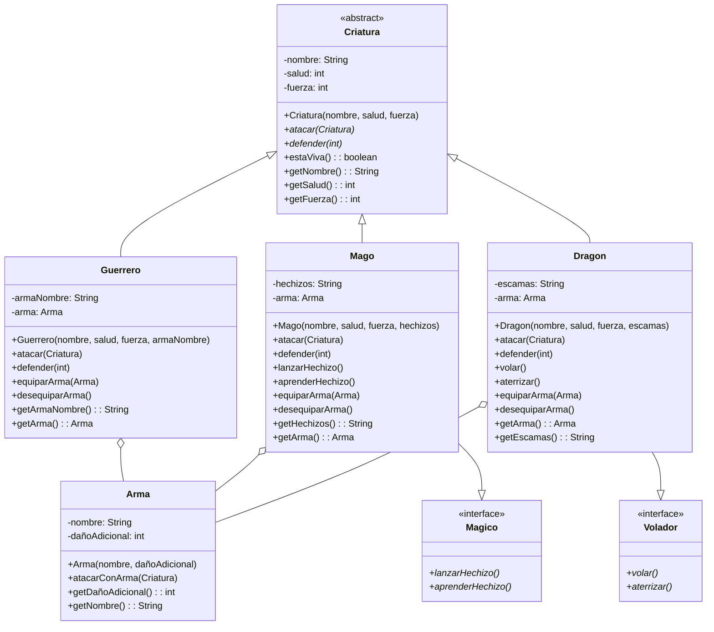

# Parcial-corte-2
## Estudiantes

Allan Caicedo
Juan Gaviria

## Diagrama de Clases

## Descripción de la Estructura

**Clase Base:**
- `Criatura` (abstracta) - Define los atributos comunes: nombre, salud, fuerza

**Clases Concretas (heredan de Criatura):**
- `Guerrero` - Combatiente cuerpo a cuerpo, reduce daño 15% con armadura
- `Mago` - Lanza hechizos, reduce daño 10% con escudo mágico
- `Dragon` - Ataca con el doble de fuerza, reduce daño 20% con escamas, puede volar

**Interfaces:**
- `Magico` - Permite lanzar y aprender hechizos (implementada por `Mago`)
- `Volador` - Permite volar y aterrizar (implementada por `Dragon`)

**Clase de Composición:**
- `Arma` - Cada criatura "tiene un arma" (relación has-a, no herencia)

